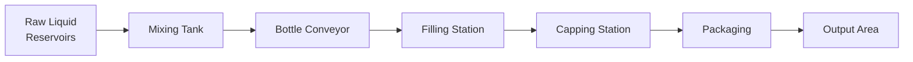
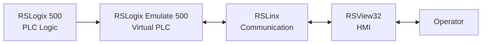
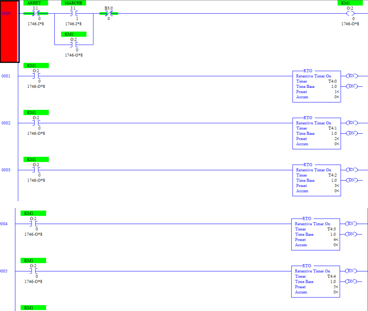
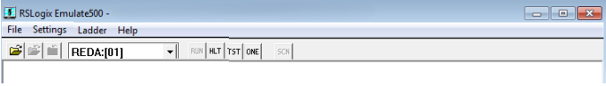

# Industrial Control — HMI & PLC

### Automated Mixing, Filling, Capping and Packaging Line

Industrial automation project developed to simulate and supervise a complete bottle-production line.

The system handles:

- preparation of a liquid mixture from three reservoirs,
- transfer to the filling station,
- automatic bottle positioning,
- filling,
- capping,
- packaging,
- carton evacuation.

The control logic was developed with **RSLogix 500**, simulated with **RSLogix Emulate 500**, connected through **RSLinx**, and supervised using **RSView32**.

---

## System Overview



---

## Control Architecture



The complete system can therefore be tested without requiring a physical PLC.

---

## Process Control

The PLC program manages:

- START / STOP control,
- main contactor `KM1`,
- timers,
- filling sequences,
- bottle and carton movement,
- pneumatic actuator timing,
- mixing operations,
- process reset and acknowledgement logic.

<p align="center">
  
</p>

---

## HMI Supervision

The RSView32 interface provides real-time visualization and operator interaction with the production line.

<p align="center">
  
</p>

The HMI uses process tags and derived tags to control animations and represent equipment states.

Examples include:

- tank level visualization,
- valve movement,
- pneumatic cylinder movement,
- mixing-pump rotation,
- process-state indication.

---

## Derived Tags & Animation

<p align="center">
  
</p>

Derived tags are used to generate calculated or logical variables from process tags.

They simplify HMI behavior and allow animation states to follow the PLC sequence.

---

## PLC Simulation

<p align="center">
  
</p>

**RSLogix Emulate 500** was used to validate the PLC program without physical automation hardware.

RSLinx provides communication between the virtual PLC and RSView32.

---

## Repository Structure

```text
Industrial-Control-HMI-PLC/
│
├── rslogix500/
│   ├── mixing_process_control.RSS
│   └── README.md
│
├── rsview32/
│   ├── Projet.rsv
│   ├── Gfx/
│   ├── TAG/
│   ├── DTS/
│   ├── VBA/
│   └── README.md
│
├── assets/
│   ├── plc/
│   └── hmi/
│
├── .gitignore
├── LICENSE
└── README.md
```

---

## Tools

| Tool | Role |
|---|---|
| RSLogix 500 | PLC ladder programming |
| RSLogix Emulate 500 | PLC simulation |
| RSLinx | PLC–HMI communication |
| RSView32 | HMI design and supervision |

---

## Project Goal

The project demonstrates the coordination of PLC logic, industrial communication and HMI supervision in a complete automated production sequence.

It provides a practical implementation of industrial automation principles without requiring physical PLC hardware.
