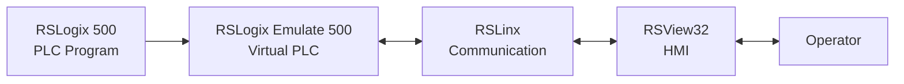
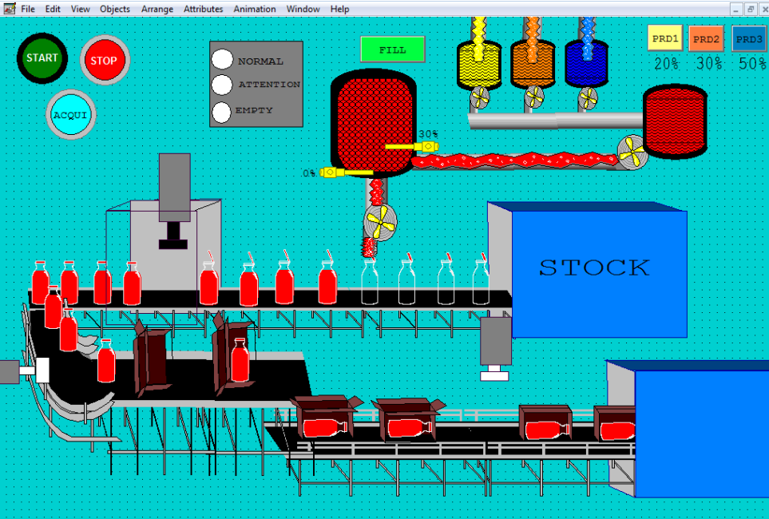

<p align="center">
  
</p>

<h1 align="center">Automated-Production-Line-PLC-HMI</h1>

<p align="center">
  <b>Automated Mixing, Filling, Capping and Packaging Line</b>
</p>

---

## Project Overview

The automated line performs the complete production sequence:


Three liquid sources are combined according to defined proportions before the mixture is transferred to the filling station.

The bottles are then positioned, filled, capped and packaged before the cartons are evacuated to the output area.

---

## System Architecture



The PLC logic is executed through **RSLogix Emulate 500**, allowing the complete control system to be tested without a physical PLC.

**RSLinx** provides communication between the simulated controller and the **RSView32** supervision interface.

---

## HMI

<p align="center">
  
</p>

The HMI gives the operator a real-time view of the production line and provides access to the main process controls and operating states.

---

## Main Technologies

| Tool | Role |
|---|---|
| **RSLogix 500** | PLC programming |
| **RSLogix Emulate 500** | Virtual PLC simulation |
| **RSLinx** | PLC–HMI communication |
| **RSView32** | HMI design and process supervision |

---

## Repository Structure

```text
Industrial-Control-HMI-PLC/
│
├── rslogix500/
│   ├── mixing_process_control.RSS
│   └── README.md
│
├── rsview32/
│   ├── Projet.rsv
│   ├── Gfx/
│   ├── TAG/
│   ├── DTS/
│   ├── VBA/
│   └── README.md
│
├── assets/
│   ├── hmi/
│   └── plc/
│
├── .gitignore
├── LICENSE
└── README.md
```

---

## Project Goal

The project demonstrates the integration of **PLC control, industrial communication and HMI supervision** in a complete automated production system.

It was designed to reproduce the behavior of an industrial production line while allowing the full control sequence to be simulated and validated without physical automation hardware.
