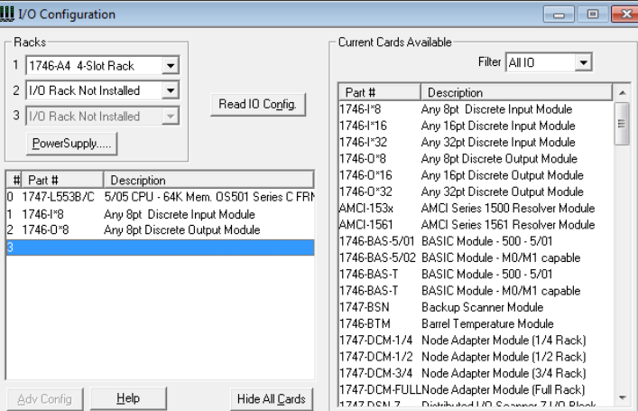
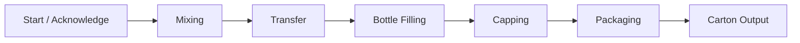
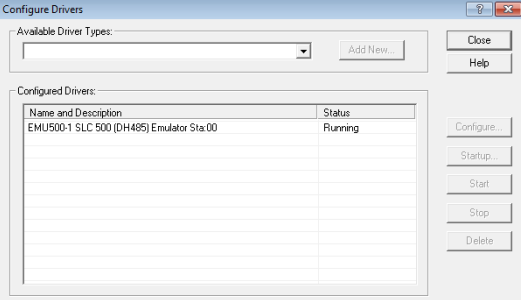

# RSLogix 500 — PLC Control

This folder contains the PLC program for the automated mixing, filling, capping and packaging line.

## Project File

```text
mixing_process_control.RSS
```

---

## I/O Configuration

The simulated PLC configuration includes:

- 8 digital inputs
- 8 digital outputs

<p align="center">
  
</p>

---

## Ladder Logic

The PLC program coordinates the complete production sequence using ladder logic.



The control logic uses:

- internal relays,
- timers,
- sequence conditions,
- actuator control,
- start / stop logic,
- acknowledgement logic,
- controlled reset behavior.

<p align="center">
  
</p>

---

## Timing Logic

Multiple timers are used to coordinate:

- bottle movement,
- carton movement,
- pneumatic cylinders,
- filling duration,
- sequential process operations.

The sequence prevents conflicting actuator commands by requiring the previous state to be confirmed before progressing.

---

## Simulation

The project was tested with **RSLogix Emulate 500**.

<p align="center">
  
</p>

This allows the PLC logic to be validated without requiring a physical controller.

---

## Communication

RSLinx provides the communication layer between the virtual PLC and RSView32.

<p align="center">
  
</p>
