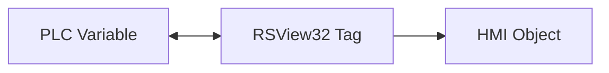
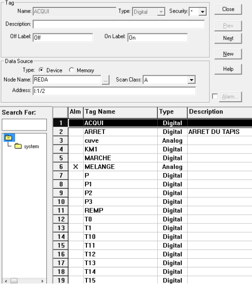
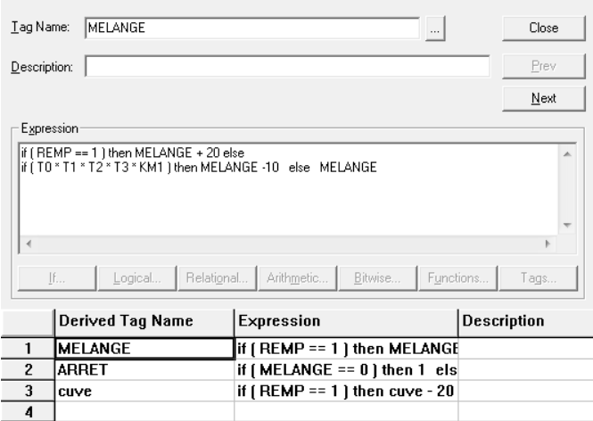
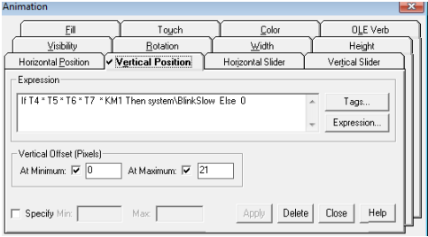
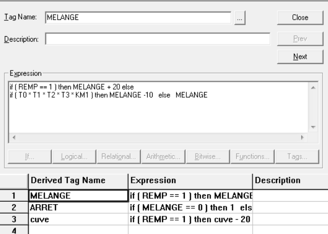
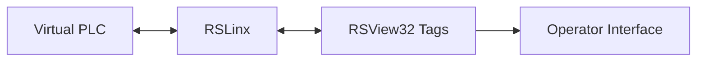

# RSView32 — HMI & Supervision

This folder contains the RSView32 HMI developed for supervision and operator control of the automated production line.

## Main Project

```text
Projet.rsv
```

---

## Main HMI

<p align="center">
  
</p>

The interface provides real-time visualization of:

- liquid reservoirs,
- mixing tank,
- filling station,
- conveyor system,
- bottles,
- pneumatic actuators,
- packaging area,
- process states.

The operator can monitor and interact with the simulated production process directly from the HMI.

---

## Tags

RSView32 tags provide the connection between PLC variables and HMI objects.

They are used to:



<p align="center">
  
</p>

---

## Derived Tags

Derived tags are used to build calculated or logical HMI variables from the base process tags.

<p align="center">
  
</p>

They help simplify animation logic and represent process states more clearly.

---

## Dynamic Animations

### Valve Movement

<p align="center">
  
</p>

Valve and actuator positions are animated according to PLC conditions and timer states.

### Mixing Pump

<p align="center">
  
</p>

The mixing pump uses rotation animation to visually indicate its operating state.

---

## Project Files

```text
rsview32/
├── Projet.rsv
├── Gfx/
├── TAG/
├── DTS/
└── VBA/
```

| Folder | Content |
|---|---|
| `Gfx/` | HMI graphical displays |
| `TAG/` | Tag database |
| `DTS/` | Derived-tag definitions |
| `VBA/` | VBA logic used by the project |

---

## Role in the System



RSView32 acts as the supervision layer of the project, allowing process monitoring, command and visualization of the complete automated line.
